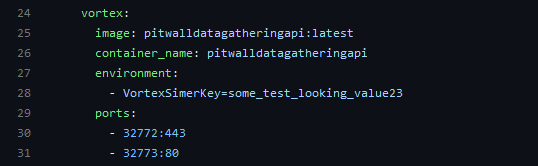
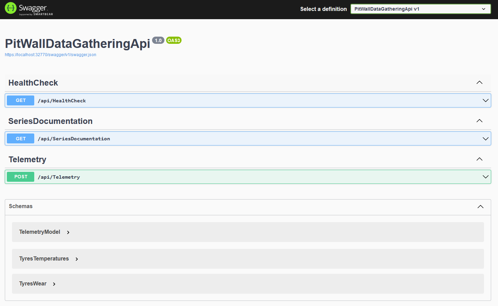

# Pitwall API

This API exposes a Metrics endpoint to allow a prometheus instance to retrieve data.

## Installation

### Requirements

- Works on Azure B1 Standard Virtual Machine

### Compiling sources

- You will need a working dotnet installation
- Build the [docker file](./src//PitWallDataGatheringApi//PitWallDataGatheringApi/Dockerfile) in [PitWallDataGatheringApi](./src//PitWallDataGatheringApi//PitWallDataGatheringApi/) folder to create the docker image.

```bash
docker build -f src/PitWallDataGatheringApi/PitWallDataGatheringApi/Dockerfile -t pitwalldatagatheringapi src/PitWallDataGatheringApi
```

### Create the container

- Go the [container folder](./src/Container/)
- Configure then simerkey
  
  - Send the simerkey to the people you wish to have the data sent from
- Run the following command :

```bash
docker compose up -d
```

- Create the container with docker compose with [compose file in Container folder](./src/Container/compose.yml)

At this point should have a running container with

- a Grafana instance
- a Prometheus instance
- a Pitwall API instance

## Exploitation

### What are the data available ?

The API is self documented by SWAGGER on one hand, and a documentation endpoint on the other hand.


### End points description

| Endpoint name                   | Description                                                |
| ------------------------------- | ---------------------------------------------------------- |
| **/api/v1/ApiHealthCheck**      | Used by the caller to check whether the API is here.       |
| **/api/v1/SeriesDocumentation** | The description of each series being exposed to Prometheus |
| **/api/v1/Telemetry**           | The endpoint to post telemetry to.                         |

The contract documentation is generated by swagger itself.

At minimum there are two mandatories fields in [Telemetry model](./src/PitWallDataGatheringApi/PitWallDataGatheringApi/Models/Business/TelemetryModel.cs) :

- **Simerkey** : The key to be able to post metrics to the API.
- **Pilot Name** : The pilot name is used to break series by pilot.

Forget one of these, and you'll be toss out immediately.

## Limitations

### Security

Althought the API has a simerkey to avoid being data poisoning, it do not have a embed DDOS security.

The system has been made very light to run almost anywhere without having coupling to an authentication system for now.

It should not be left active all the time because no advanced pentesting has been made.

### Disk space

I currently have not metrics about the growth of the disk space.

It works on a Standard B1 on Azure.

## See also

- [Simhub Pitwall Acquisition Plugin](https://github.com/macreiben-dev/pit-wall-acquisition)
